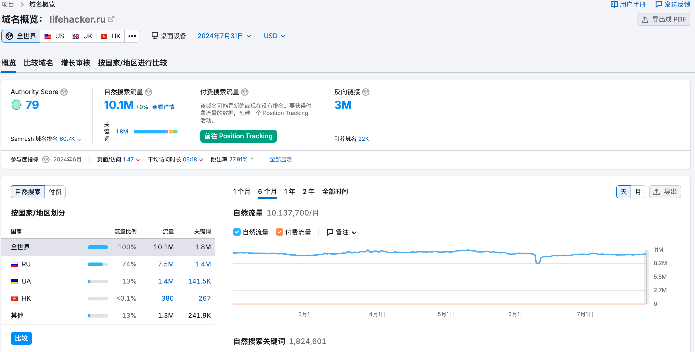
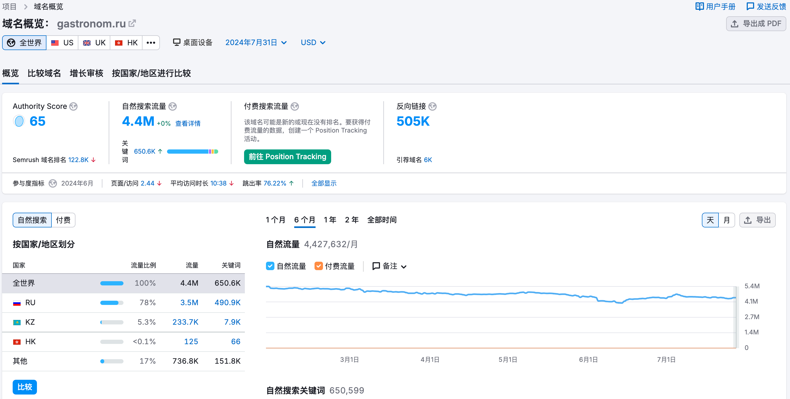

# 整理目标

## 收集目标网址数据

| 序号        | 地址   | 缩略图   |  流量  |  关键词 | 页面/访问 | 平均访问时长| 跳出率 |  反向链接  |
| :--------  | :-----  |:-----  | :---- |:---- | :----| :----  | :---- | :----:  |
| 1 | [https://russianfood.com](https://russianfood.com) | | 27.1M|800.8K|2.87|04:17|40.99%|1.4M|
| 2 | [https://lifehacker.ru](https://lifehacker.ru) | |10.1M|1.8M|1.47|05:18|77.91%|3M|
| 5 | [https://eda.ru](https://eda.ru) | |8.9M|594.9|2.04|05:14|71.11%|141.7K|
| 3 | [https://gastronom.ru](https://gastronom.ru) | |4.4M|650.6k|2.44|10.38|76.22%|505K|
| 4 | [https://iamcook.ru](https://iamcook.ru) | |4.4M|608.4K|1.61|05:51|76.51%|107.9K|

## 从收集的目标中挑选

- 挑选过程看这里→ [挑选过程](./logs.md)
