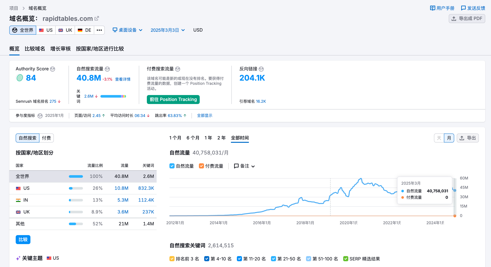
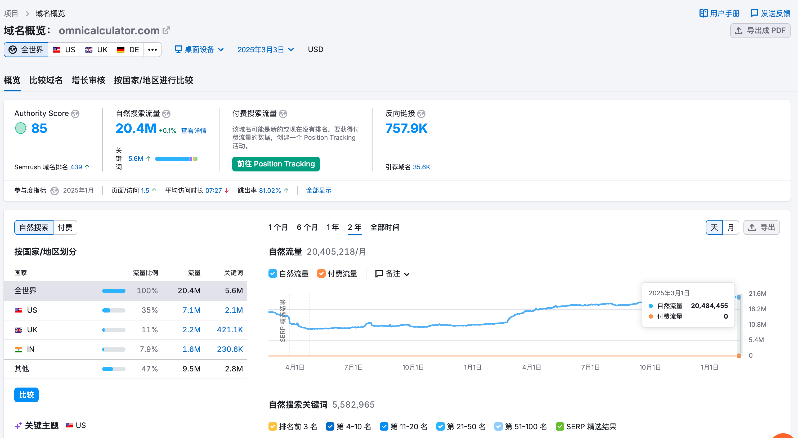
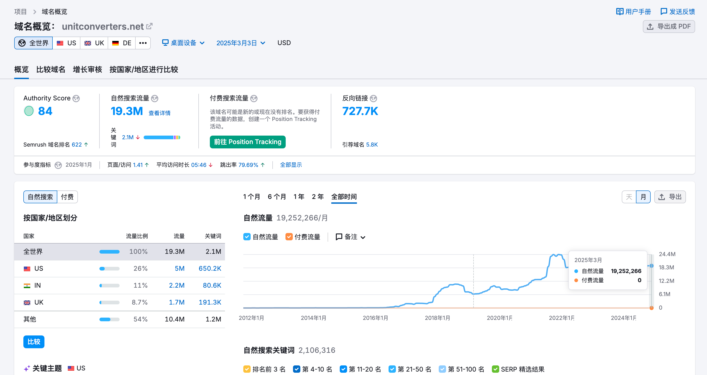
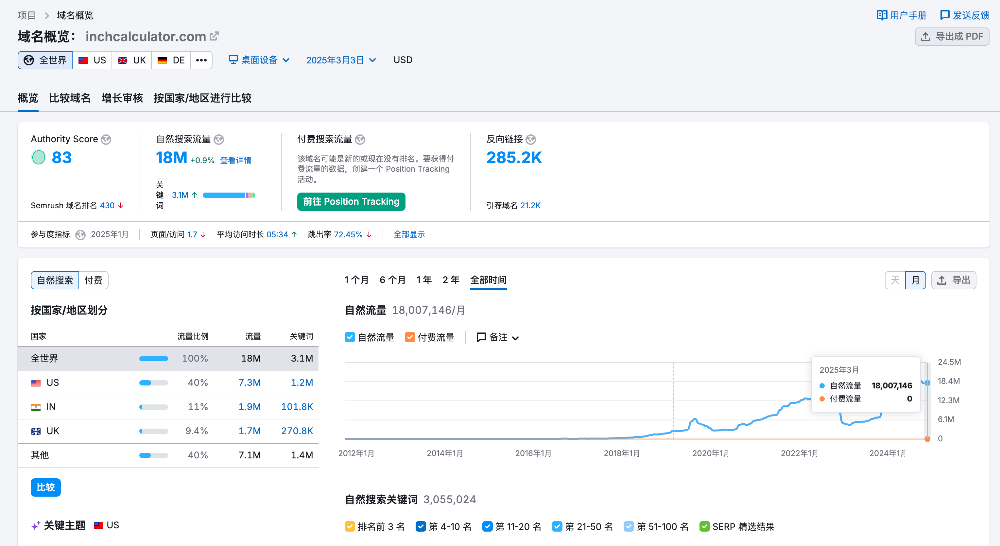
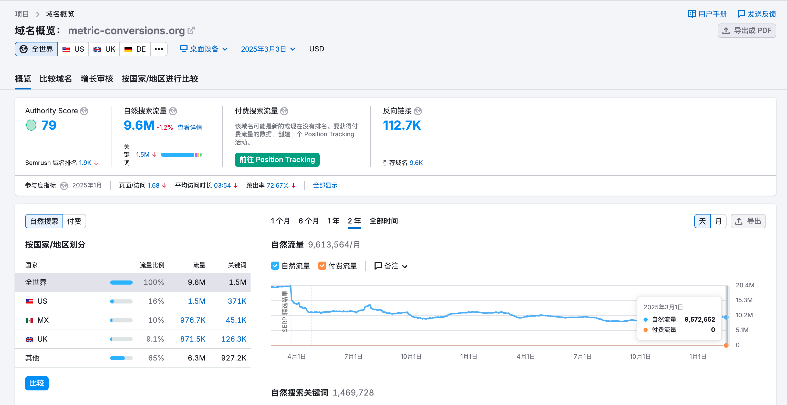

# 整理目标

## 收集目标网址数据

| 序号        | 地址   | 缩略图   |  流量  |  关键词 | 页面/访问 | 平均访问时长| 跳出率 |  反向链接  |
| :--------  | :-----  |:-----  | :---- |:---- | :----| :----  | :---- | :----:  |
| 1 | [https://rapidtables.com](https://rapidtables.com) | |40.8M|2.6M|2.45|06:34|63.83%|204.1K|
| 2 | [https://omnicalculator.com](https://omnicalculator.com) | | 20.4M|5.6M|1.5|07:27|81.02|757.9K|
| 3 | [https://unitconverters.net](https://unitconverters.net) | |19.3M|2.1M|1.41|05:46|79.69%|727.7K|
| 4 | [https://inchcalculator.com](https://inchcalculator.com) | |18M|3.1M|1.7|05:34|72.45%|285.2K|
| 5 | [https://metric-conversions.org](https://metric-conversions.org) | |9.6M|1.5M|1.68|03:54|72.67%|112.7K|

## 从收集的目标中挑选

- 挑选过程看这里→ [挑选过程](./logs.md)
